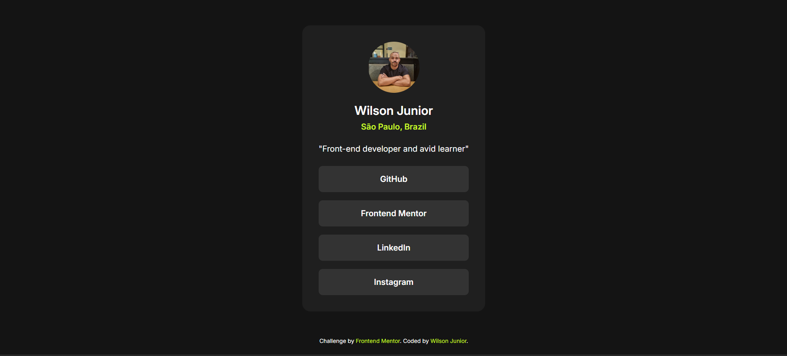

# Frontend Mentor | Social Links Profile

## Overview

This is a solution to the [Social Links Profile](https://www.frontendmentor.io) challenge on Frontend Mentor. The objective of this project is to create a profile page with social media links using HTML and CSS, while ensuring a responsive and visually appealing design.

## Table of Contents

- [Overview](#overview)
- [Screenshot](#screenshot)
- [Built With](#built-with)
- [What I Learned](#what-i-learned)
- [Continued Development](#continued-development)
- [Author](#author)
- [Acknowledgments](#acknowledgments)

## Screenshot

## Built With

- Semantic HTML5 markup
- CSS custom properties
- Flexbox
- Google Fonts

## What I Learned

Through this project, I gained more experience with:

- CSS Flexbox for layout structuring.
- The use of CSS custom properties (variables) for consistent styling.
- Applying hover effects with CSS transitions to enhance user interaction.

## Continued Development

In the future, I plan to:

- Improve the responsiveness for smaller screens.
- Add more social links and possibly include icons for a better user experience.
- Explore advanced CSS techniques like Grid for more complex layouts.

## Author

- Frontend Mentor - [@willsf2021](https://www.frontendmentor.io/profile/willsf2021)
- GitHub - [@willsf2021](https://github.com/willsf2021)
- LinkedIn - [Wilson Junior](https://www.linkedin.com/in/wilson-j%C3%BAnior-6956052a8/)

## Acknowledgments

This project was inspired by the challenges on [Frontend Mentor](https://www.frontendmentor.io). Special thanks to the community for providing feedback and support.
